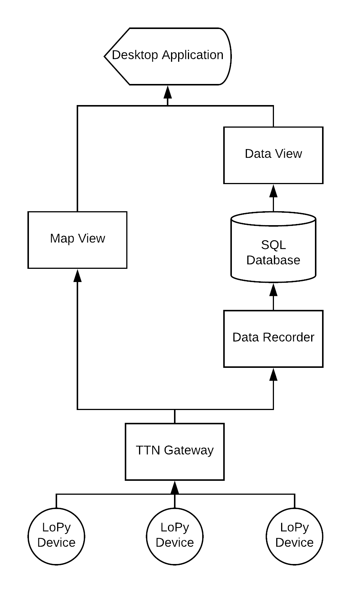
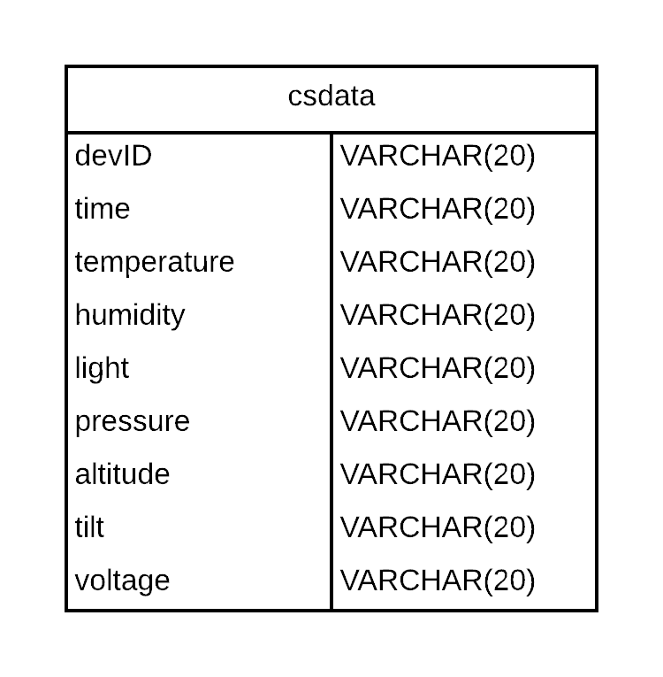

# citystats
**Using LoPy IoT devices to measure a city's conditions**   
  
The general data flow of the system is as follows:  
  
   
  
Advantages of this system:  
* System can be expanded with more devices very easily.
* The map view is very quick, as there is no overhead of the server.
* The data is stored centrally and thus can be accessed from any computer. 
* SQL operations can be done on the data before it is served. 
  
     
## Parts ## 

### CityStats ### 
[Located here](CityStats).   
This is the micro-python code that is uploaded to the LoPy device.  
It reads a range of measurements from the PySense module and sends the data if there has been a significant change (10%).        

### MapApp ### 
[Located here](MapApp).   
This is the Java application used to view data from the devices.   
  
The main views of the application are:   
* Map view using Google Maps, (implemented in Java using JxMaps). 
* Graph view showing the history of data received (uses JFreeChart). 

  
### DataServer ###
[Located here](DataServer/Java).   
This is the Java code that stores all received data onto a SQL server. 
  
The database is structured as below: 
    

## Libraries ## 
A number of external libraries were used to create this project. 
    
These include:
* [JFreeChart](http://www.jfree.org/jfreechart/) - to create graphs on MapApp.  
* [JxMaps](https://www.teamdev.com/jxmaps) - to display a map on MapApp.   
* [OpenWeatherMap Java API by xSAVIKx](https://github.com/xSAVIKx/openweathermap-java-api) - to display data from [OpenWeatherMap](https://openweathermap.org/) on MapApp.  
* [TheThingsNetwork Java API](https://github.com/TheThingsNetwork/java-app-sdk) - to receive data from TTN on MapApp and DataServer.
* [PySense library](https://github.com/pycom/pycom-libraries/tree/master/pysense) - to read data from PySense. 

## Helpful links ## 
These are some websites which were extremely useful when creating this project.   
* [Official PyCom documentation](https://docs.pycom.io/chapter/gettingstarted/).  
* [The Things Network usage guide](https://www.thethingsnetwork.org/docs/devices/lopy/usage.html).  
* [Latitude and Longitude of a location](https://www.latlong.net/).   

