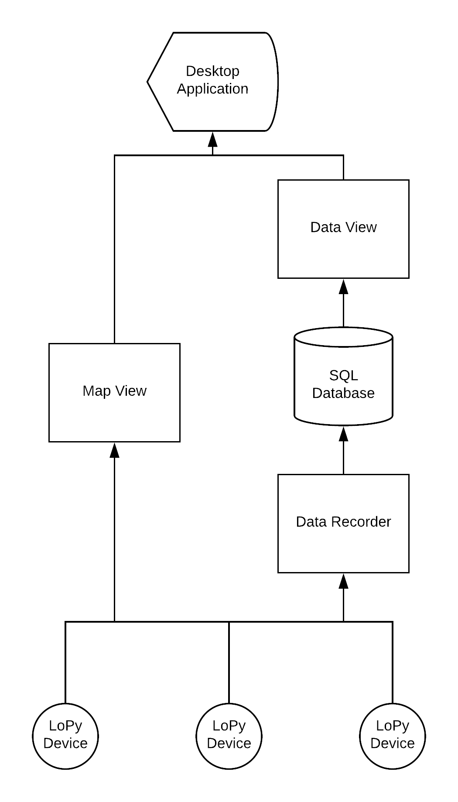

# citystats
**Using LoPy IoT devices to measure a city's conditions**   
  
The general data flow of the system is as follows:
    
  
Advantages of this system:  
* System can be expanded with more devices very easily.
* The map view is very quick, as there is no overhead of the server.
* The data is stored centrally and thus can be accessed from any computer. 
* SQL operations can be done on the data before it is served. 
  
     
## Parts ## 

### CityStats ### 
This is the micro-python code that is uploaded to the LoPy device.  

### MapApp ### 
This is the Google Maps Java application used to view data from the devices. 

### DataServer ###
This is the python code that stores all received data onto a server. 

## Libraries ## 
A number of libraries and APIs were used to create this project. 

## Helpful links ## 
These are some websites which were extremely useful when creating this project.   
* [Official PyCom documentation](https://docs.pycom.io/chapter/gettingstarted/).  
* [The Things Network usage guide](https://www.thethingsnetwork.org/docs/devices/lopy/usage.html).  
* [Latitude and Longitude of a location](https://www.latlong.net/).   

